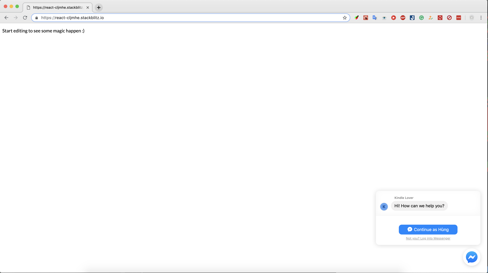
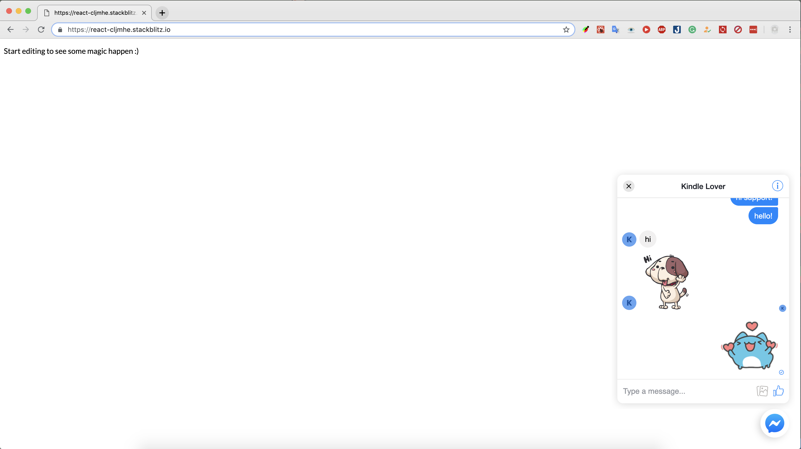
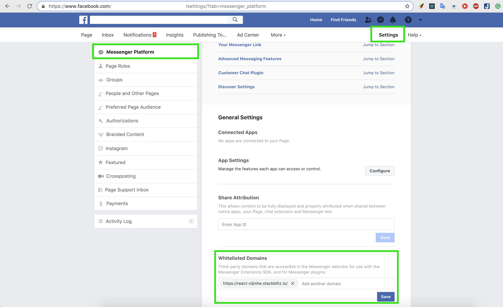
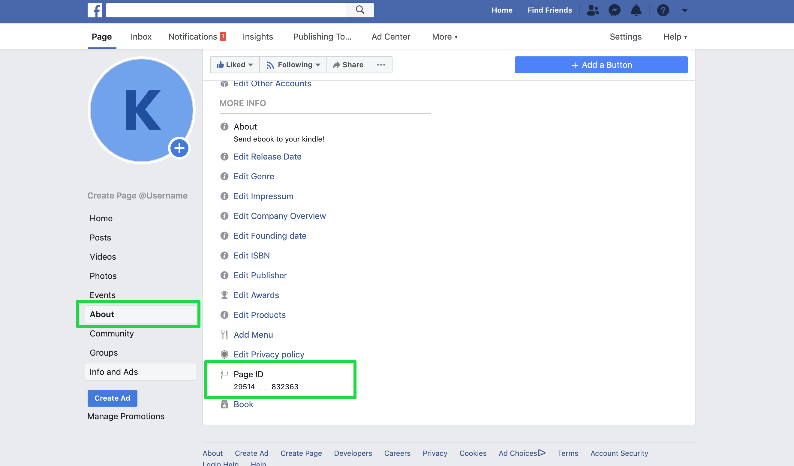

# React Customer Chat

<p align="center">
  
  
</p>

# Install

```js
npm install react-customer-chat --save
```

# Setting Up the Plugin

Go to Page Settings > Messenger Platform > Whitelisted Domains

<p align="center">
  
</p>

* How To Find Facebook Page ID?

Go to the Facebook page you own/admin > “About” > “Page Info.”

Now, at the very bottom, you can find the “Facebook Page ID”.

<p align="center">
  
</p>

# Usage:

```javascript
import CustomerChat from 'react-customer-chat'

<CustomerChat
  pageId={******}
  />
```


# Props
* pageId: your page id
* include attribute [Customizing the Plugin](https://developers.facebook.com/docs/messenger-platform/discovery/customer-chat-plugin#customization)

 
 # Pull request
  Pull requests are welcome!
